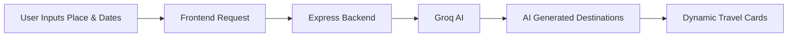

<div align="center">

# 🌍 TRAVELOOP

### AI Powered Travel Planning Platform

<p align="center">
  
  
  
  
</p>

<br/>


### ✈️ Smart Travel Discovery with AI

Modern AI-powered travel planner that helps users discover destinations dynamically using Groq AI.

</div>

---

# ✨ Features

<table>
<tr>
<td width="50%">

## 🤖 AI Powered Suggestions
- Smart travel recommendations
- Dynamic destination discovery
- Context-aware AI responses
- Real-time suggestion generation

</td>

<td width="50%">

## 🎨 Modern UI
- Glassmorphism interface
- Fullscreen cinematic background
- Smooth animations
- Responsive design

</td>
</tr>
</table>

---

# 🛠️ Tech Stack

<div align="center">

| Frontend | Backend | AI |
|----------|----------|----|
| React.js | Node.js | Groq API |
| Vite | Express.js | Llama 3 |
| Tailwind CSS | MongoDB | AI Suggestions |
| Framer Motion | REST APIs | Dynamic Prompting |

</div>

---

# 📂 Project Structure

```bash
Traveloop
│
├── frontend
│   ├── src
│   │   ├── assets
│   │   ├── pages
│   │   ├── components
│   │   └── App.jsx
│   │
│   └── package.json
│
├── backend
│   ├── routes
│   ├── controllers
│   ├── models
│   ├── server.js
│   └── .env
│
└── README.md
```

---

# ⚙️ Installation

## 1️⃣ Clone Repository

```bash
git clone https://github.com/your-username/traveloop.git

cd traveloop
```

---

## 2️⃣ Frontend Setup

```bash
cd frontend

npm install

npm run dev
```

### Frontend runs on:

```bash
http://localhost:5173
```

---

## 3️⃣ Backend Setup

```bash
cd backend

npm install

npm run dev
```

### Backend runs on:

```bash
http://localhost:5001
```

---

# 🔑 Environment Variables

Create `.env` file inside backend folder:

```env
PORT=5001

GROQ_API_KEY=your_groq_api_key

MONGO_URI=your_mongodb_connection
```

---

# 🤖 AI Suggestion Flow



---

# 🔥 API Endpoint

## Generate Travel Suggestions

```http
POST /api/trips/generate
```

### Example Request

```json
{
  "place": "London",
  "startDate": "2026-05-12",
  "endDate": "2026-05-18"
}
```

---

# 🎨 UI Highlights

<div align="center">

| 🌌 Glassmorphism | 🎥 Background Video | ⚡ Smooth Animations |
|------------------|---------------------|----------------------|
| 🤖 AI Suggestions | 🌍 Dynamic Cards | 📱 Responsive Layout |

</div>

---

# 🚀 Future Scope

- 🔐 User Authentication
- 💾 Save Trips
- 🗺️ Interactive Maps
- ✈️ Flight Recommendations
- 🏨 Hotel Suggestions
- 📅 AI Itinerary Generator
- 👥 Collaborative Trip Planning
- 💰 Budget Planner

---

# 👨‍💻 Team

Built with creativity, AI, and hackathon energy.

---

# 📜 License

MIT License

Free to use and modify.

---

<div align="center">


# ⭐ Star the Repository if you like the project

</div>