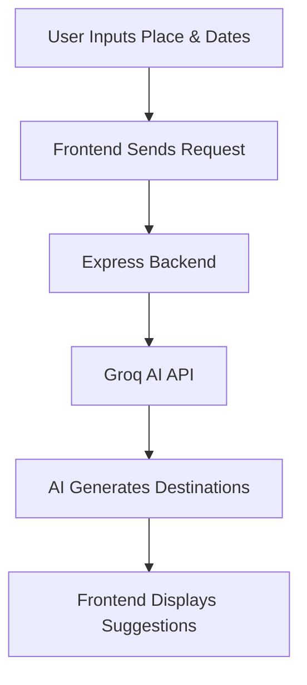

<div align="center">

# ✈️ TRAVELOOP

### AI Powered Smart Travel Planner


---

### 🌍 Discover • ✨ Explore • 🤖 Plan with AI

</div>

---

# 🚀 About Traveloop

Traveloop is an AI-powered travel planning platform that helps users discover amazing destinations instantly using intelligent travel recommendations.

Built with a futuristic glassmorphism UI, immersive background visuals, and AI-generated suggestions, Traveloop transforms trip planning into a beautiful interactive experience.

---

# ✨ Features

## 🤖 AI Travel Suggestions
- Smart destination recommendations
- Dynamic AI-generated trip ideas
- Context-aware travel discovery

---

## 🎥 Immersive UI Experience
- Fullscreen cinematic video background
- Glassmorphism design
- Smooth animations using Framer Motion
- Modern dark futuristic aesthetic

---

## 🌍 Dynamic Destination Cards
- AI-generated travel cards
- Dynamic images
- Interactive hover animations
- Travel taglines

---

## ⚡ Fast & Responsive
- Mobile responsive layout
- Optimized frontend
- Real-time API integration

---

# 🛠️ Tech Stack

<div align="center">

| Frontend | Backend | AI |
|----------|----------|----|
| React.js | Node.js | Groq AI |
| Vite | Express.js | Llama 3 |
| Tailwind CSS | MongoDB | AI Suggestions |
| Framer Motion | REST APIs | Dynamic Prompts |

</div>

---

# 📂 Project Structure

```bash
Traveloop/
│
├── frontend/
│   ├── src/
│   │   ├── assets/
│   │   ├── pages/
│   │   ├── components/
│   │   └── App.jsx
│   │
│   └── package.json
│
├── backend/
│   ├── routes/
│   ├── controllers/
│   ├── models/
│   ├── server.js
│   └── .env
│
└── README.md
```

---

# ⚙️ Installation

# 1️⃣ Clone Repository

```bash
git clone https://github.com/your-username/traveloop.git

cd traveloop
```

---

# 2️⃣ Frontend Setup

```bash
cd frontend

npm install

npm run dev
```

### Frontend runs on:

```bash
http://localhost:5173
```

---

# 3️⃣ Backend Setup

```bash
cd backend

npm install

npm run dev
```

### Backend runs on:

```bash
http://localhost:5001
```

---

# 🔑 Environment Variables

Create `.env` inside backend folder:

```env
PORT=5001

GROQ_API_KEY=your_groq_api_key

MONGO_URI=your_mongodb_connection
```

---

# 🤖 Groq AI Setup

## Create Groq Account

👉 https://console.groq.com

---

## Generate API Key

Copy your API key and add it inside:

```env
GROQ_API_KEY=your_key_here
```

---

# 🔥 API Endpoint

# Generate Travel Suggestions

```http
POST /api/trips/generate
```

---

## Example Request

```json
{
  "place": "London",
  "startDate": "2026-05-12",
  "endDate": "2026-05-18"
}
```

---

# 🧠 AI Suggestion Flow



---

# 🎨 UI Highlights

✅ Glassmorphism Panels  
✅ Neon Green Accents  
✅ Background Video  
✅ Dynamic Cards  
✅ Smooth Motion Animations  
✅ Responsive Design  
✅ AI-Powered Recommendations  

---

# 📸 Preview

<div align="center">


</div>

---

# 🚀 Future Improvements

- 🔐 Authentication
- 💾 Save Trips
- 🗺️ Maps Integration
- ✈️ Flight Recommendations
- 🏨 Hotel Suggestions
- 👥 Collaborative Trip Planning
- 📅 AI Itinerary Generator
- 💰 Budget Estimator
 

---

# 📜 License

MIT License

Free to use and modify.

---

<div align="center">

# 🌟 THANK YOU

### If you like this project, give it a ⭐ on GitHub


</div>